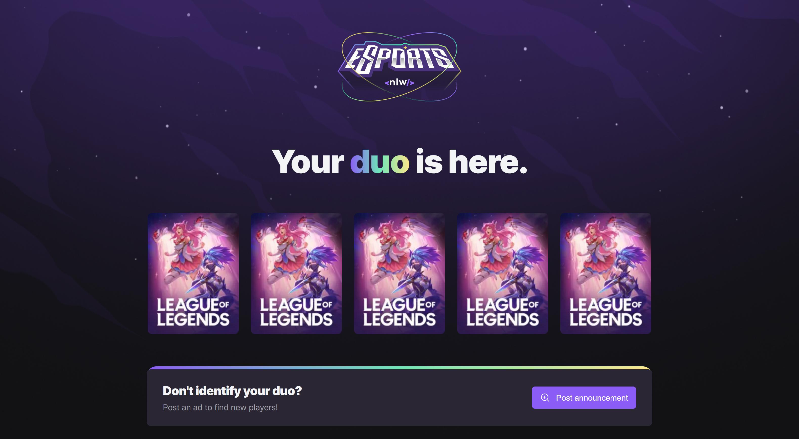
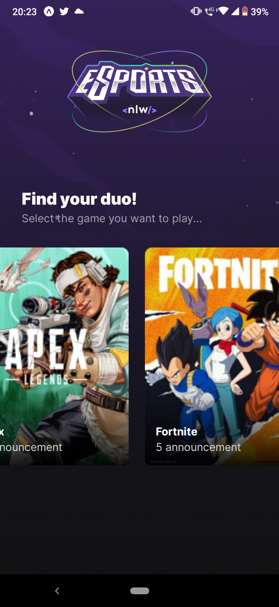

<h1 align="center">
    
</h1>
<h4 align="center">
    Trilha Ignite<br>
</h4>
<!-- <h4 align="center">Projeto web construído durante o Next Level Week #09-Ignite com a Rocketseat/DiegoFernandes | Rodrigo Gonçalves.</h4> -->
<p align="center">
    
    <a href="https://lp.rocketseat.com.br/nlw">
        </img>
    </a>
    
    <a href="https://github.com/NyctibiusVII/eSports/blob/main/LICENSE">
        
    </a>
    <a href="https://picpay.me/Matheus_nyctibius_vii">
        
    </a>
</p>
<p align="center">
    <a href="#esports-">Projeto</a>&nbsp;&nbsp;&nbsp;|&nbsp;&nbsp;&nbsp;
    <a href="#tecnologias-">Tecnologias</a>&nbsp;&nbsp;&nbsp;|&nbsp;&nbsp;&nbsp;
    <a href="#layout-">Layout</a>&nbsp;&nbsp;&nbsp;|&nbsp;&nbsp;&nbsp;
    <a href="#licença-%EF%B8%8F">Licença</a>
</p>
<!--
<p align="center">
    <a href="README.md">Inglês</a>
    ·
    <a href="README-pt.md">Português</a>
</p>
-->

# eSports 
Projeto desenvolvido para conectar pessoas a jogar um 'duo' juntas nos games mais 'hypados' da Twitch. O projeto coleta os jogos que estão mais em alta na Twitch e disponibiliza para que usuários façam um 'match' com outros e joguem juntos o mesmo jogo. Projeto realizado na Next Level Week #9 @Rocketseat.

#### Funcionalidades
* Listagem de jogos mais populares na Twitch
* Match de jogadores para jogar juntos
* Perfil do usuário com informações do jogo e do jogador
* Chat para conversar com o jogador
* Exclusivo para jogos eletrônicos (E-Sports)

#### Milha Extra🔥
<details>
    <summary>Desafios</summary>

```
GERAL:
    ✔ - Documentar bem o projeto
    ✖ - Completar os desafios

DESKTOP:
    ✖ - NO AR (Online / Vercel)
    ✖ - SEO:
        ✖ - Texto para <noscript />
        ✖ - Shortcut icon
        ✔ - Meta tags:
            ✔ - Facebook (og:~)
            ✔ - Twitter (twitter:~)
    ✖ - Melhorar o estilo:
        ✔ - Mobile First
        ✔ - Responsividade
        ✔ - Design
        ✖ - Trocar o tema da aplicação:
            ✖ - Light
            ✔ - Dark
            ✖ - Imagens adaptadas para o 'light e dark'
        ✖ - Animações (framer-motion)
        ✖ - Cores:
            ✖ - Seleção do mouse (:selection)
            ✖ - Adaptadas para daltônicos
    ✖ - Acessibilidade:
        ✖ - Navegação por TAB / SHIFT+TAB
        ✖ - Texto alternativo em imagens
        ✖ - Texto descritivo em title e area-label

MOBILE:
    ✖ - NO AR (Online / Apple Store && Google Play)
    ✖ - Melhorar o estilo:
        ✖ - Design
        ✖ - Trocar o tema da aplicação:
            ✖ - Light
            ✔ - Dark
            ✖ - Imagens adaptadas para o 'light e dark'
        ✖ - Animações (framer-motion)

NODE:
    ✖ - NO AR (Online / Heroku)
    ✔ - ORM (Prisma)
    ✖ - Testes (Jest)
    ✔ - Banco de dados:
        ✔ - SQLite
```
</details>

## Tecnologias 🚀
Esse projeto foi desenvolvido com as seguintes tecnologias:
<details>
    <summary>WEB___</summary>
    <a href='https://reactjs.org'>React</a><br>
    <a href='https://sass-lang.com'>Sass</a><br>
    <a href='https://www.typescriptlang.org'>Typescript</a>
</details>
<details>
    <summary>NODE___</summary>
    <a href='https://nodejs.org/pt-br'>Node</a><br>
    <a href='https://www.prisma.io'>Prisma</a><br>
    <a href='https://www.typescriptlang.org'>Typescript</a>
</details>
<details>
    <summary>MOBILE___</summary>
    <a href='https://expo.dev'>Expo</a><br>
    <a href='https://reactnative.dev'>React Native</a><br>
    <a href='https://www.typescriptlang.org'>Typescript</a><br>
    <a href='https://axios-http.com/docs/intro'>Axios</a>
</details>

## Layout 🚧
### Desktop Screenshot
<div style="display: flex; flex-direction: 'column'; align-items: 'center';">
    
</div>

### Mobile Screenshot
<div style="display: flex; flex-direction: 'row';">
    
</div>
    <!-- IMGS
      ------------------------------
      Web
      Mobile
      ------------------------------
    -->

## Rodando o projeto 🚴🏻‍♂️
#### "Só vou dar uma olhadinha...":
  <a href="https://esports-nyctibiusvii.vercel.app">💬 Site hospedado na Vercel 📋</a>

#### Na sua maquina:
<details>
    <summary>Dependências</summary>

```json
  ------- WEB -------
  "dependencies": {
    "next": "12.3.0",
    "next-themes": "^0.2.1",
    "phosphor-react": "^1.4.1",
    "react": "18.2.0",
    "react-dom": "18.2.0",
    "sass": "^1.54.9"
  },
  "devDependencies": {
    "@types/node": "18.7.16",
    "@types/react": "18.0.19",
    "@types/react-dom": "18.0.6",
    "eslint": "8.23.1",
    "eslint-config-next": "12.3.0",
    "next-sitemap": "^3.1.22",
    "typescript": "4.8.3"
  }

  ------- NODE -------
  "dependencies": {
    "@prisma/client": "^4.3.1",
    "cors": "^2.8.5",
    "express": "^4.18.1"
  },
  "devDependencies": {
    "@types/cors": "^2.8.12",
    "@types/express": "^4.17.13",
    "prisma": "^4.3.1",
    "ts-node-dev": "^2.0.0",
    "typescript": "^4.8.3"
  }

  ------- MOBILE -------
  "dependencies": {
    "@expo-google-fonts/inter": "^0.2.2",
    "expo": "~46.0.9",
    "expo-font": "^10.2.0",
    "expo-linear-gradient": "^11.4.0",
    "expo-status-bar": "~1.4.0",
    "react": "18.0.0",
    "react-dom": "18.0.0",
    "react-native": "0.69.5",
    "react-native-safe-area-context": "^4.3.3",
    "react-native-web": "~0.18.7"
  },
  "devDependencies": {
    "@babel/core": "^7.12.9",
    "@types/react": "~18.0.14",
    "@types/react-native": "~0.69.1",
    "typescript": "~4.3.5"
  }
```
> Ex: `$ npm install _____` ou `$ yarn add _____` para instalar as dependências

> Utilize a tag `-D` para instalar as dependências de desenvolvimento.<br>
> Utilize a tag `@types` para instalar o suporte a Typescript.<br>
> Utilize a tag `@latest` para instalar a versão mais recente.
</details>

```bash
# Clone o repositório
$ git clone https://github.com/NyctibiusVII/eSports.git

# Acesse a pasta do projeto no terminal
$ cd eSports

# Acesse a pasta do sub-projeto no terminal:
$ cd web                         # Projeto ReactJS
$ cd node                        # Projeto NodeJS
$ cd mobile                      # Projeto React Native

# Instale as dependências com o gerenciador de pacotes de sua preferência
$ npm install   /   yarn add     # Serve para ReactJS, NodeJS e React Native

# Execute o sub-projeto:
# ---------- PARA WEB ---------- #
$ npm run dev   /   yarn dev     # Para rodar o projeto Web (Frontend)

# --------- PARA NODE ---------- #
$ npm run dev   /   yarn dev     # Para rodar o projeto Node (Backend)

# -------- PARA MOBILE --------- #
$ npm run start   /   yarn start # Para o projeto Mobile (Frontend Mobile)

# O ReactJS roda na porta: 3000
# O NodeJS roda na porta: 3333
# O React Native roda na porta: 19000

# Acesse http://localhost:$PORT *Ex: Cuidado para não ligar dois ou mais projetos na mesma porta, pois o servidor pode não iniciar.
```

## Contribuição 💭
Para construir essa aplicação tive a ajuda dos professores **Diego Fernandes** e **Rodrigo Gonçalves** da Rocketseat que disponibilizaram video aulas do projeto **eSports** e ajudaram no ensino das<br>
- linguagens {<br>
&nbsp;&nbsp;&nbsp;&nbsp;ReactJS,<br>
&nbsp;&nbsp;&nbsp;&nbsp;NodeJS,<br>
&nbsp;&nbsp;&nbsp;&nbsp;React Native<br>
}

além também de ter a ajuda desta grande comunidade que a Rocketseat construiu no *Discord*.

Para ajudar no projeto confira a página de [contribuição](./CONTRIBUTING) para ver como começar uma discussão e começar a contribuir.

### Hashtags \#
| Dias  | Hashtags           |
|-------|--------------------|
| Dia 1 | #LevelUp           |
| Dia 2 | #Journey           |
| Dia 3 | #UntilTheEnd       |
| Dia 4 | #~                 |
| Dia 5 | #~                 |

## Licença ⚖️
Este projeto está sob a licença do MIT. Veja o arquivo [LICENSE](https://github.com/NyctibiusVII/eSports/blob/main/LICENSE) para mais detalhes.

## Contato ✉️
| [](https://github.com/NyctibiusVII) |
| :---: |
| <sub>[Matheus Vidigal](https://github.com/NyctibiusVII)</sub> |

<p align="left">
    <a href="https://www.linkedin.com/in/matheus-vidigal-nyctibiusvii/">
        
    </a>
    <a href="https://mail.google.com/mail/u/1/#inbox?compose=GTvVlcSGLCKpKJfwPsKKqzXBplKkGtCLvCQcFWdWxCxQFfkHzzjVkgzrMFPBgKBmWFHvrjrCsMqSH">
        
    </a>
</p>